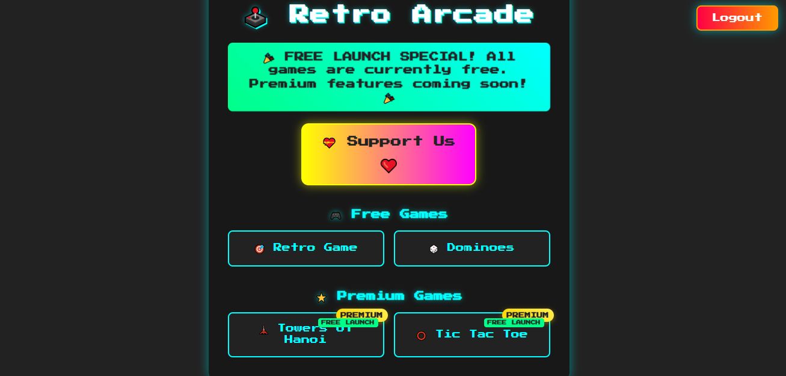
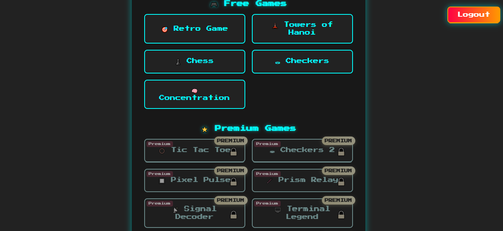
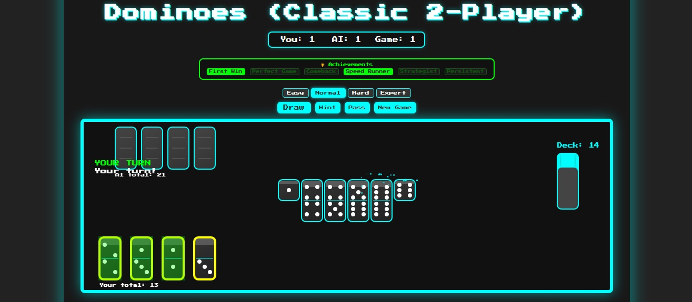
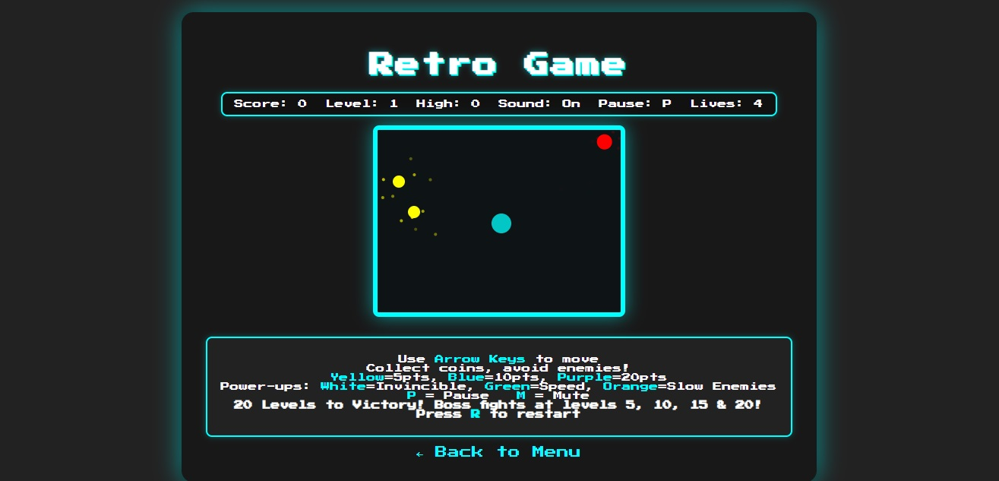
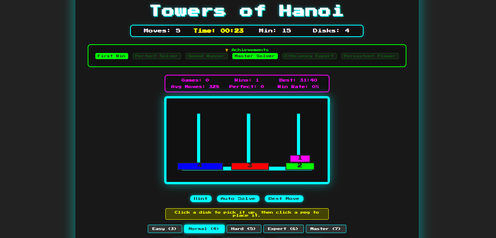
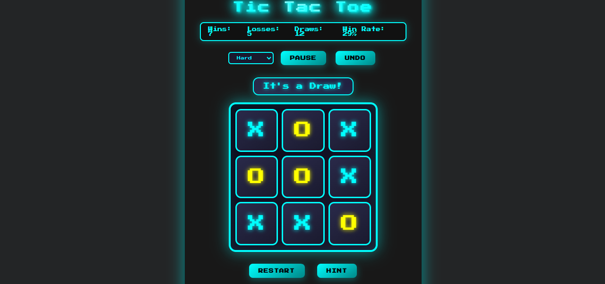
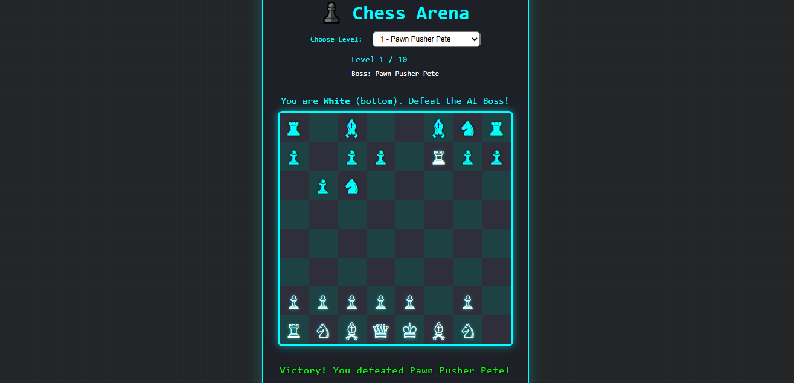
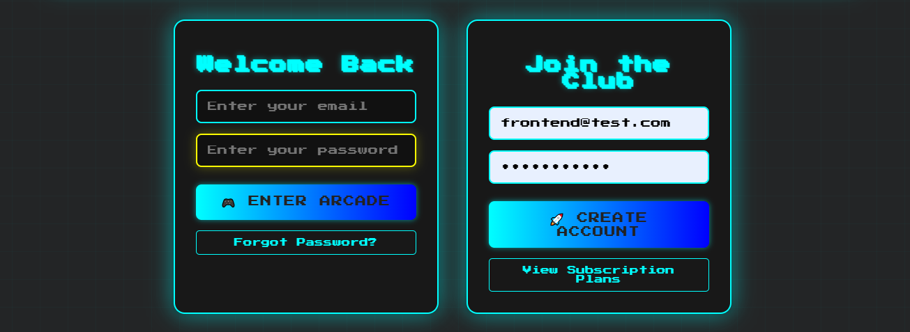

# 🕹️ Retro Arcade Collection

**A nostalgic collection of classic arcade games built with modern web t### 🎬 Interactive Demo

## 🎬 Interactive Demo
See the arcade experience in action—menu navigation and gameplay:


## 🌐 Live Demo

🎮 **[Try it live here!](https://retrogame.tech)** 

Experience the available games instantly - no installation required! The demo includes:
- ✅ Retro Game and Dominoes (free)
- ✅ Towers of Hanoi and Tic Tac Toe (premium/coming soon)
- ✅ User registration and login
- ✅ Progress tracking and high scores  
- ✅ Mobile-responsive design
- ✅ All features currently free during launch

## 🚀 Quick Startogies**

[](https://retrogame.tech)
[](https://opensource.org/licenses/MIT)
[](https://nodejs.org/)
[](https://expressjs.com/)

> 🎯 **Play original retro-inspired games with user accounts, progress tracking, and achievements!**

---

## 📑 Table of Contents

- [🌟 Features](#-features)
- [📸 Screenshots & Demos](#-screenshots--demos)
- [🚀 Quick Start](#-quick-start)
- [⚙️ Configuration](#️-configuration)
- [🛠️ Tech Stack](#️-tech-stack)
- [📁 Project Structure](#-project-structure)
- [🎮 Game Features](#-game-features)
- [🚀 Deployment](#-deployment)
- [🤝 Contributing](#-contributing)
- [📝 License](#-license)

---

## 🌟 Features

### 🎯 Classic Games

| Game | Description | Features | Difficulty |
|------|-------------|----------|------------|
| 🎯 **Retro Game** | Custom arcade experience | Unique mechanics | ⭐⭐ |
| 🎲 **Dominoes** | Classic tile matching | Authentic rules | ⭐⭐ |
| 🗼 **Towers of Hanoi** | Ancient mathematical puzzle | Multiple disk configurations | ⭐⭐⭐ |  
| ⭕ **Tic-Tac-Toe** | Strategic grid warfare | AI opponent | ⭐ |  

### 🔐 User System
- Secure registration and login
- Password hashing with bcrypt
- JWT-based authentication
- Email verification (optional)
- Password reset functionality
- Game progress tracking
- Achievement system

### 🎨 Modern Features
- Responsive retro design
- Sound effects and animations
- Local high score storage
- Cross-browser compatibility
- Progressive enhancement
- Mobile-friendly controls

### 🔮 Future Premium Features (Phase 2)
- Stripe subscription integration
- Cloud save synchronization
- Leaderboards and tournaments
- Exclusive premium games
- Advanced statistics


## 📸 Screenshots & Demos


### 🎮 Main Arcade Menu


### 🖼️ New Main Menu Screenshot


### 🎲 Dominoes Game


### 🎯 Retro Game Special


### 🗼 Towers of Hanoi



### ⭕ Tic-Tac-Toe


### ♟️ Chess


### 👤 User Registration


### 🎬 Interactive Demo


## �🚀 Quick Start

### Prerequisites
- Node.js (v16 or higher)
- npm or yarn

### Installation

1. **Clone the repository**
   ```bash
   git clone https://github.com/Jr-star3/retro-arcade.git
   cd retro-arcade
   ```

2. **Install dependencies**
   ```bash
   npm install
   ```

3. **Set up environment variables**
   ```bash
   cp .env.example .env
   # Edit .env with your configuration
   ```

4. **Start the development server**
   ```bash
   npm run dev
   ```

5. **Open your browser**
   ```
   http://localhost:3000
   ```

## ⚙️ Configuration

### Environment Variables

Copy `.env.example` to `.env` and configure:

```env
# Server Configuration
PORT=3000
NODE_ENV=development

# JWT Authentication (generate a strong secret)
JWT_SECRET=your-super-secret-jwt-key-here

# Email Configuration (Gmail App Password recommended)
EMAIL_USER=your-email@gmail.com
EMAIL_PASS=your-gmail-app-password

# Stripe Configuration (for future premium features)
STRIPE_SECRET_KEY=sk_test_your_stripe_secret_key
STRIPE_PUBLISHABLE_KEY=pk_test_your_stripe_publishable_key

# Frontend URL (for email links and CORS)
FRONTEND_URL=http://localhost:3000
```

### Email Setup (Gmail)
1. Enable 2-factor authentication on your Gmail account
2. Generate an App Password: Google Account → Security → App passwords
3. Use the generated password (not your regular Gmail password)

## 🎮 Game Controls

| Game | Controls |
|------|----------|
| **Retro Game** | Arrow keys or WASD |
| **Dominoes** | Mouse/touch |
| **Towers of Hanoi** | Mouse/touch (Premium) |
| **Tic-Tac-Toe** | Mouse/touch (Premium) |

## 📱 Mobile Support

All games are optimized for mobile devices with:
- Touch controls for movement
- Responsive layouts
- Optimized button sizes
- Swipe gestures where applicable

## 🛠️ Development

### Project Structure
```
retro-arcade/
├── server.js           # Express server with authentication
├── public/            # Frontend files
│   ├── index.html     # Login/registration page
│   ├── arcade.html    # Game selection menu
│   └── auth.js        # Authentication logic
├── games/             # Individual game files
│   ├── retro-game.html
│   ├── dominoes.html
│   └── ...
├── pages/             # Static pages
│   ├── about-us.html
│   └── ...
└── users.db          # SQLite database (auto-generated)
```

### Available Scripts
```bash
npm start       # Production server
npm run dev     # Development with auto-reload
npm test        # Run tests (placeholder)
```

### Adding New Games
1. Create your game HTML file in `/games/`
2. Include retro styling and responsive design
3. Add game entry to `arcade.html`
4. Follow the existing game structure for consistency

## 🔒 Security Features

- **Password Security**: bcrypt hashing with salt
- **Rate Limiting**: Protection against brute force attacks
- **CORS Configuration**: Secure cross-origin requests
- **Input Validation**: Server-side validation with express-validator
- **Helmet**: Security headers for production
- **JWT**: Secure session management

## 📊 Current Status: Free Launch 🎉

**All games are currently FREE!** 

The app is launched without payment barriers to gather user feedback and build community. Premium features and subscriptions will be added in Phase 2 based on user demand.

## 🚀 Deployment

### Quick Deploy Options

**Frontend-only (GitHub Pages)**
```bash
# Deploy games as static site
npm run build-static
# Push to gh-pages branch
```

**Full-stack (Railway/Render)**
```bash
# Railway
railway login
railway init
railway up

# Render
# Connect GitHub repo to Render dashboard
```

**Environment Variables for Production**
- Set `NODE_ENV=production`
- Use strong `JWT_SECRET`
- Configure production database
- Set correct `FRONTEND_URL`

## 🤝 Contributing

We welcome contributions! Here's how to get started:

1. **Fork the repository**
2. **Create a feature branch**: `git checkout -b feature/amazing-game`
3. **Make your changes** and test thoroughly
4. **Commit**: `git commit -m 'Add amazing new game'`
5. **Push**: `git push origin feature/amazing-game`
6. **Submit a Pull Request**

### Contribution Ideas
- 🎮 New classic games (Asteroids, Centipede, etc.)
- 🎨 UI/UX improvements
- 📱 Mobile optimizations
- 🔧 Bug fixes and performance improvements
- 📚 Documentation improvements
- 🌍 Internationalization

## 📋 Roadmap

### Phase 1: Free Launch ✅
- [x] Core games collection
- [x] User authentication
- [x] Progress tracking
- [x] Mobile optimization

### Phase 2: Premium Features (Q2 2025)
- [ ] Stripe integration
- [ ] Cloud save sync
- [ ] Global leaderboards
- [ ] Tournament system
- [ ] Premium game library

### Phase 3: Community (Q3 2025)
- [ ] User-generated content
- [ ] Game sharing platform
- [ ] Developer API
- [ ] Plugin system

## 🐛 Bug Reports

Found a bug? Please create an issue with:
- Browser and version
- Steps to reproduce
- Expected vs actual behavior
- Screenshots if applicable

## 📄 License

This project is licensed under the MIT License - see the [LICENSE](LICENSE) file for details.

## 🙏 Acknowledgments

- Inspired by classic arcade games of the 80s and 90s
- Built with modern web technologies
- Special thanks to the retro gaming community

## 📞 Support

- 🐛 **Bug Reports**: [GitHub Issues](https://github.com/Jr-star3/retro-arcade/issues)
- 💡 **Feature Requests**: [GitHub Discussions](https://github.com/Jr-star3/retro-arcade/discussions)  
- 📧 **Contact**: Create an issue for support
- 🌟 **Like the project?** Give it a star!

---

<div align="center">

**[🎮 Play Now](https://retrogame.tech) | [📖 Documentation](https://github.com/Jr-star3/retro-arcade#readme) | [🤝 Contribute](CONTRIBUTING.md)**

Made with ❤️ for retro gaming enthusiasts

</div>

</div>
